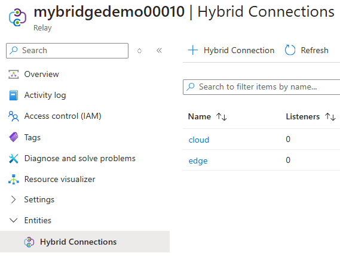

# Azure Relay Bridge Demo

## Background

[Azure Relay documentation](https://learn.microsoft.com/en-us/azure/azure-relay/)

[Bridging Connectivity: Exploring Azure Relay Bridge (azbridge)](https://techcommunity.microsoft.com/blog/messagingonazureblog/bridging-connectivity-exploring-azure-relay-bridge-azbridge/4294267)

[Azure Relay Bridge](https://github.com/Azure/azure-relay-bridge)

[Azure Relay Hybrid Connections protocol](https://learn.microsoft.com/en-us/azure/azure-relay/relay-hybrid-connections-protocol)

[Customize CoreDNS with Azure Kubernetes Service -> Use custom domains](https://learn.microsoft.com/en-us/azure/aks/coredns-custom#use-custom-domains)

[Pricing](https://azure.microsoft.com/en-us/pricing/details/service-bus/)

> Hybrid connections are charged per listener unit and for any data overage exceeding the included 5 GB/month.
>
> Hybrid Connection Pricing<br/>
> Connection charge (includes 5 GB of data/month): **€9.311 per listener**<br/>
> Data transfer overage (data exceeding the included 5 GB/month): **€0.952/GB**<br/>

The above gives use ~20 euros per month for the below architecture + data transfer overage + egress from cloud.

## Scenario

Download latest version of [Azure Relay Bridge](https://github.com/Azure/azure-relay-bridge/releases/latest).

Add `azbridge` to path or add full path to `$azbridge`:

```powershell
$azbridge = "C:\Users\...\Downloads\azbridge.0.15.0.win-x64\azbridge.exe"
```

Create Azure Relay:

```powershell
$namespace = "mybridgedemo00001"
$resourceGroup = "rg-bridge"
$location = "swedencentral"

az group create --name $resourceGroup --location $location

az relay namespace create -g $resourceGroup --name $namespace

$relayScope = az relay namespace show -g $resourceGroup --name $namespace --query "id" --output tsv
$currentUser = az ad signed-in-user show --query "id" --output tsv

# Allow current user to freely use relay resources
az role assignment create --assignee $currentUser --role "Azure Relay Owner" --scope $relayScope
```

Create Edge listener and authorization rules:

```powershell
az relay hyco create -g $resourceGroup --namespace-name $namespace --name "edge"

az relay hyco authorization-rule create -g $resourceGroup --hybrid-connection-name "edge" --namespace-name $namespace -n "send-to-edge" --rights Send
az relay hyco authorization-rule create -g $resourceGroup --hybrid-connection-name "edge" --namespace-name $namespace -n "listen-on-edge" --rights Listen

$sendToEdge = az relay hyco authorization-rule keys list -g $resourceGroup --hybrid-connection-name "edge" --namespace-name $namespace -n "send-to-edge" --query "primaryConnectionString" --output tsv
$listenOnEdge = az relay hyco authorization-rule keys list -g $resourceGroup --hybrid-connection-name "edge" --namespace-name $namespace -n "listen-on-edge" --query "primaryConnectionString" --output tsv
```

Create Cloud listener and authorization rules:

```powershell
az relay hyco create -g $resourceGroup --namespace-name $namespace --name "cloud"

az relay hyco authorization-rule create -g $resourceGroup --hybrid-connection-name "cloud" --namespace-name $namespace -n "send-to-cloud" --rights Send
az relay hyco authorization-rule create -g $resourceGroup --hybrid-connection-name "cloud" --namespace-name $namespace -n "listen-on-cloud" --rights Listen

$sendToCloud = az relay hyco authorization-rule keys list -g $resourceGroup --hybrid-connection-name "cloud" --namespace-name $namespace -n "send-to-cloud" --query "primaryConnectionString" --output tsv
$listenOnCloud = az relay hyco authorization-rule keys list -g $resourceGroup --hybrid-connection-name "cloud" --namespace-name $namespace -n "listen-on-cloud" --query "primaryConnectionString" --output tsv
```



Start `CloudService` (http://localhost:5267) and `EdgeService` (http://localhost:5177) applications.
Test that they're running correctly:

```powershell
curl -H "Authorization: custom 123" "http://localhost:5267/"
curl -H "Authorization: custom 123" "http://localhost:5177/"
```

Start `Cloud Listener` (a "remote forwarder" is a listener that is bound to a relay and forwards to a local port):

```powershell
. $azbridge -T "cloud:localhost:5267" -x $listenOnCloud
```

Start `Edge Listener` (a "remote forwarder" is a listener that is bound to a relay and forwards to a local port):

```powershell
. $azbridge -T "edge:localhost:5177" -x $listenOnEdge
```

Start `Cloud to Edge Forwarder` (a "local forwarder" is a listener that is bound to a local port and forwards to a relay):

```powershell
. $azbridge -L "localhost:8000:edge" -x $sendToEdge
```

Start `Edge to Cloud Forwarder` (a "local forwarder" is a listener that is bound to a local port and forwards to a relay):

```powershell
. $azbridge -L "localhost:9000:cloud" -x $sendToCloud
```

Now you test this by invoking the following HTTP request to call `Cloud` from the `Edge`:

```powershell
curl -H "Authorization: custom 123" "http://localhost:9000/"
```

Output:

```powershell
"Response from Cloud Service"
```

Similarly, you test invoking the following HTTP request to call `Edge` from the `Cloud`

```powershell
curl -H "Authorization: custom 123" "http://localhost:8000/"
```

Output:

```powershell
"Response from Edge Service"
```

### Possible issues

#### Server side redirects

If you call HTTP endpoint (e.g., "http://...") and you have the following code in you server app:

```csharp
app.UseHttpsRedirection();
```

Server would try to redirect from http to https and it would not work, since the mapping is to single port.

### HTTPS challenges

Read [Hostnames and Addresses](https://github.com/Azure/azure-relay-bridge?tab=readme-ov-file#hostnames-and-addresses)
for more details.
